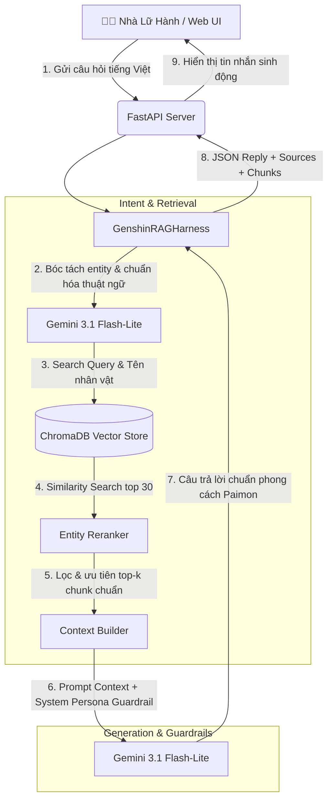

# ✦ Genshin Impact AI Companion (Paimon AI) ✦

<p align="center">
  
</p>

<p align="center">
  <strong>Trợ lý ảo thông minh đồng hành cùng Nhà Lữ Hành trên lục địa Teyvat!</strong><br>
  <em>Hệ thống RAG (Retrieval-Augmented Generation) chuyên sâu về Genshin Impact tích hợp Google Gemini & ChromaDB.</em>
</p>

<p align="center">
  
  
  
  
  
  
</p>

---

## 📖 Giới thiệu (Overview)

**GI-AI-Helper** là một ứng dụng trợ lý ảo được xây dựng theo phong cách và giọng điệu của **Paimon** — người bạn đồng hành đáng yêu của Nhà Lữ Hành trong tựa game *Genshin Impact*. 

Dự án kết hợp sức mạnh của mô hình ngôn ngữ lớn **Google Gemini** cùng hệ thống **RAG (Truy xuất tăng cường thế hệ mới)** để giải đáp chính xác các thắc mắc về:
- ⚔️ **Nhân vật & Vũ khí**: Bộ kỹ năng, cung mệnh, thiên phú, nguyên liệu nâng cấp, chỉ số cơ bản.
- 🏺 **Thánh Di Vật & Build Đội hình**: Lựa chọn chỉ số chính/phụ, bộ hiệu ứng 2 món/4 món phù hợp.
- 📜 **Cốt truyện & Lore**: Lịch sử các vùng đất Teyvat, thông tin các nhân vật, NPC, tổ chức (Fatui, Thất Tinh Liyue, Hiệp Hội Nhà Mạo Hiểm...).
- 🎭 **Cơ chế sự kiện & Endgame**: Nhà Hát Giả Tưởng (Imaginarium Theater), La Hoàn Thâm Cảnh (Spiral Abyss).

---

## ✨ Tính năng nổi bật (Key Features)

- **🧚 Persona Paimon chân thực**: Tự xưng là *Paimon*, gọi người chơi là *Nhà Lữ Hành*, phản hồi dí dỏm, nhí nhảnh và thân thiện.
- **⚡ Multilingual Vector Retrieval**: Sử dụng mô hình embedding đa ngôn ngữ `sentence-transformers/paraphrase-multilingual-MiniLM-L12-v2` giúp kết nối mượt mà giữa các câu hỏi tiếng Việt và dữ liệu wiki tiếng Anh.
- **🎯 Intent Parsing & Entity Reranking**: 
  - Tự động nhận diện thực thể tên nhân vật/vật phẩm (`extract_search_intent`).
  - Dịch câu hỏi sang thuật ngữ game chuẩn tiếng Anh.
  - Tự động ưu tiên (boost rank) các chunk dữ liệu trúng thực thể đích.
- **🛡️ Guardrail chống Hallucination (Ảo giác)**: Ép mô hình chỉ trả lời dựa trên tài liệu truy xuất thực tế và trích dẫn rõ nguồn file (`sources`).
- **🕷️ Automated Wiki Crawler**: Tool cào dữ liệu tự động từ Genshin Impact Fandom Wiki, giữ cấu trúc bảng biểu và chuyển đổi hình ảnh icon vật phẩm thành văn bản có ý nghĩa.
- **🎨 Giao diện Web Genshin Aesthetic**: UI/UX mang đậm phong cách Genshin Impact với hiệu ứng bầu trời sao rơi, ánh sáng huyền ảo, font chữ đặc trưng và hỗ trợ phát âm thanh.
- **📊 LLM-as-a-Judge Evaluation**: Bộ harness kiểm thử tự động so sánh câu trả lời của bot với ground truth để đo lường độ chính xác (Accuracy %).

---

## 🏗️ Kiến trúc hệ thống (System Architecture)



---

## 📂 Cấu trúc thư mục (Directory Structure)

```text
GI-AI-Helper/
├── .env                       # File cấu hình biến môi trường (API Key)
├── .gitignore                  # Cấu hình bỏ qua các file không cần commit Git
├── LICENSE                    # Giấy phép mã nguồn mở (GPL-3.0)
├── README.md                  # Tài liệu hướng dẫn dự án
├── requirements.txt           # Danh sách các thư viện Python cần thiết
├── main.py                    # Điểm khởi chạy FastAPI backend server
├── getdata.py                 # Script cào dữ liệu từ Genshin Fandom Wiki
├── ingest.py                  # Script nhúng (embed) và nạp dữ liệu vào ChromaDB
├── chroma_db/                 # Thư mục lưu trữ Vector Database cục bộ
├── data/                      # Dữ liệu tài liệu game dạng text (.txt)
│   ├── Characters/            # Dữ liệu nhân vật (Playable, NPCs, Factions...)
│   ├── Items/                 # Dữ liệu vũ khí, thánh di vật, nguyên liệu...
│   └── Lore/                  # Cốt truyện, nhiệm vụ, sách vở...
├── src/
│   ├── core/
│   │   └── harness.py         # RAG pipeline chính (Intent extraction, retrieval & rerank)
│   ├── services/
│   │   ├── llm_service.py     # Tương tác trực tiếp với Google Gemini API
│   │   └── rag_service.py     # Cấu hình ChromaDB loader, splitter & search cơ bản
│   └── frontend/
│       ├── index.html         # Giao diện Web Chat Paimon (HTML/CSS/JS)
│       └── assets/            # Font chữ Genshin (ja-jp.ttf), hình ảnh & âm thanh
└── test/
    ├── eval_datatest.json     # Bộ câu hỏi & câu trả lời chuẩn (Ground Truth)
    └── eval_harness.py        # Kịch bản đánh giá LLM-as-a-judge tự động
```

---

## 🚀 Hướng dẫn cài đặt & Chạy dự án (Getting Started)

### 1. Yêu cầu hệ thống (Prerequisites)
- **Python**: Phiên bản `3.10` trở lên.
- **Google Gemini API Key**: Lấy API Key miễn phí tại [Google AI Studio](https://aistudio.google.com/).

---

### 2. Cài đặt môi trường

1. **Clone repository về máy**:
   ```bash
   git clone https://github.com/BinhThanhh/GI-AI-Helper.git
   cd GI-AI-Helper
   ```

2. **Tạo và kích hoạt môi trường ảo (Virtual Environment)**:
   - **Windows (PowerShell)**:
     ```powershell
     python -m venv venv
     .\venv\Scripts\Activate.ps1
     ```
   - **Linux / macOS**:
     ```bash
     python3 -m venv venv
     source venv/bin/activate
     ```

3. **Cài đặt các gói phụ thuộc (Dependencies)**:
   ```bash
   pip install -r requirements.txt
   ```

---

### 3. Cấu hình biến môi trường (`.env`)

Tạo một file `.env` tại thư mục gốc của dự án và điền API Key của bạn:

```env
GOOGLE_API_KEY=your_gemini_api_key_here
```

---

### 4. Chuẩn bị dữ liệu Vector Database (Tùy chọn nếu chưa có sẵn `chroma_db/`)

Nếu muốn thu thập dữ liệu mới nhất hoặc làm mới cơ sở dữ liệu:

1. **Cào dữ liệu từ Wiki**:
   ```bash
   python getdata.py
   ```
   *(Dữ liệu sẽ được lưu vào thư mục `genshin_wiki_full_tree/` hoặc `data/`)*

2. **Vectorize & Ingest vào ChromaDB**:
   ```bash
   python ingest.py
   ```

---

### 5. Khởi chạy ứng dụng (Run Application)

1. **Khởi chạy Backend Server**:
   ```bash
   python main.py
   ```
   *Hoặc sử dụng uvicorn:*
   ```bash
   uvicorn main:app --host 127.0.0.1 --port 8000 --reload
   ```
   Backend sẽ lắng nghe tại: `http://127.0.0.1:8000`

2. **Mở giao diện người dùng (Frontend)**:
   - Mở trực tiếp file `src/frontend/index.html` bằng trình duyệt web bất kỳ hoặc sử dụng tiện ích *Live Server* trên VS Code.
   - Bắt đầu trò chuyện và đặt câu hỏi cho Paimon!

---

## 📡 API Endpoints

### 1. Kiểm tra trạng thái (Health Check)
- **Endpoint**: `GET /`
- **Response**:
  ```json
  {
    "status": "OK",
    "message": "Paimon is ready!"
  }
  ```

### 2. Gửi tin nhắn trò chuyện (Chat)
- **Endpoint**: `POST /chat`
- **Request Body**:
  ```json
  {
    "message": "Nguyên liệu đột phá của Raiden Shogun gồm những gì vậy Paimon?"
  }
  ```
- **Response**:
  ```json
  {
    "reply": "Hehe, để Paimon nói cho Nhà Lữ Hành nghe nè! Để đột phá Lôi Thần Raiden Shogun, bạn sẽ cần: Ngọc Lôi, Quả Vajrada, Lông Vũ Bão Tố (từ Lôi Âm Biểu Chướng) và Quả Amakumo từ Đảo Seirai đó nha! Đừng quên chuẩn bị đủ Mora nữa nhé!",
    "sources": [
      "data\\Characters\\Playable\\Raiden Shogun.txt"
    ],
    "chunks_used": 6
  }
  ```

---

## 🧪 Đánh giá & Kiểm thử (Evaluation Harness)

Dự án tích hợp cơ chế tự động đánh giá chất lượng mô hình theo phương pháp **LLM-as-a-judge**:

```bash
python test/eval_harness.py
```

Quy trình đánh giá sẽ:
1. Đọc danh sách câu hỏi kiểm thử và đáp án chuẩn từ `test/eval_datatest.json`.
2. Chạy pipeline RAG để sinh câu trả lời thực tế.
3. Dùng một model thẩm phán (Gemini) để so sánh và chấm `PASS` / `FAIL`.
4. Xuất báo cáo tỉ lệ chính xác (`Accuracy %`).

---

## 🛠️ Công nghệ sử dụng (Tech Stack)

| Thành phần | Công nghệ / Thư viện |
| :--- | :--- |
| **Ngôn ngữ** | Python 3.10+ |
| **Web Framework** | [FastAPI](https://fastapi.tiangolo.com/), [Uvicorn](https://www.uvicorn.org/) |
| **LLM & AI** | [Google GenAI SDK](https://github.com/googleapis/python-genai) (`gemini-3.1-flash-lite`, `gemini-2.0-flash`) |
| **RAG & Vector DB** | [ChromaDB](https://www.trychroma.com/), [LangChain](https://www.langchain.com/) |
| **Embedding Model** | `sentence-transformers/paraphrase-multilingual-MiniLM-L12-v2` |
| **Data Processing** | `BeautifulSoup4`, `Requests`, `RecursiveCharacterTextSplitter` |
| **Frontend** | HTML5, CSS3 Glassmorphism, JavaScript, Canvas Animations |

---

## 📜 Giấy phép (License)

Dự án được phân phối dưới giấy phép **GNU General Public License v3.0 (GPL-3.0)**. Xem chi tiết tại file [LICENSE](LICENSE).

---

<p align="center">
  Made with ❤️ for the Genshin Impact Community by <strong>BinhThanhh</strong>
</p>
